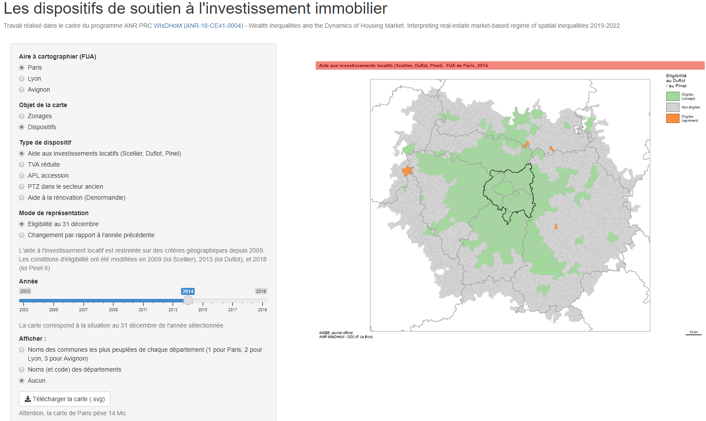

### Application shiny

Outre la reproductibilité, le second enjeu de la diffusion des résultats est relatif à leur lisibilité. L’important volume de données traitées (documenté dans ce [dépôt](https://github.com/riateStage/dispositif_lebrun)) et la complexité de leur structuration nécessite de réfléchir à un mode de restitution qui ne nécessite pas d’entrer dans les subtilités du document Rmarkdown. Une visualisation interactive des zonages A/B/C et de l’éligibilité à certains dispositifs d’aide à l’investissement immobilier pour les trois FUA à l’étude a été réalisée (application Shiny). L’exécution de celle-ci ouvre une fenêtre interactive à partir de laquelle l’utilisateur ou l’utilisatrice peut choisir le type de carte qu’il ou elle souhaite obtenir. L’application permet de choisir : la FUA (Paris, Lyon ou Avignon), le type de zonage (A/B/C ou 1/2/3) ou de dispositif (aide fiscale à l’investissement locatif, TVA réduite, PTZ dans l’ancien, APL accession ou Denormandie) ainsi que l’année. Dans la mesure où l’application Shiny repose sur un [code R](https://github.com/riateStage/dispositif_lebrun_shiny/blob/main/app.R), il est tout à fait possible d’en enrichir le contenu au fil des contributions et de l’avancement du projet WIsDHoM.



Le lancement de cette application requiert l'installation et l'exécution de 7 packages. Dans un IDE, il faut ensuite lancer la fonction `runGitHub` pour construire l'application et y accéder. 

```
# Packages nécessaires à l'exécution de l'application
library(shiny)
library(shinythemes)
library(shinycssloaders)
library(sf)
library(dplyr)
library(cartography)
library(readxl)

# Lancer l'application
shiny::runGitHub(repo = "riateStage/dispositif_lebrun_shiny", ref = "main")
```

Ce script utilise les données produites et documentées dans le dépôt [dispositif_lebrun](https://github.com/riateStage/dispositif_lebrun)